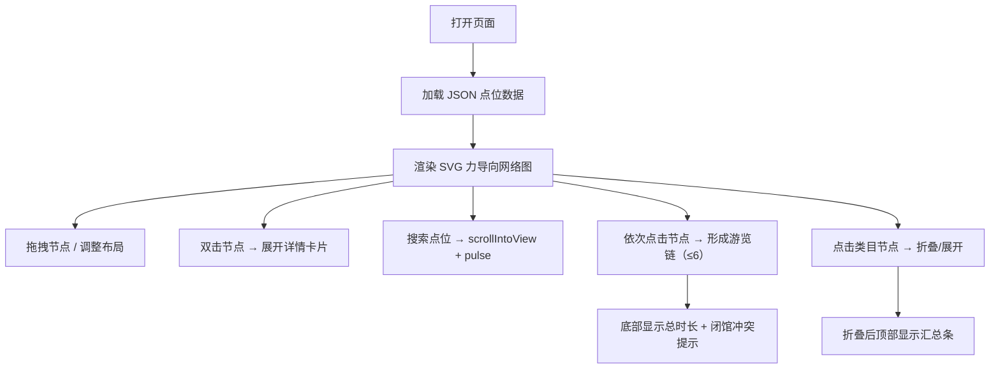

## 1. 产品概述
暑期城市行走研学路线规划可视化工具，帮助路线设计师将十余个研学点位（博物馆、非遗工坊、江滩生态带等）的依赖关系、时间约束进行可视化管理，摆脱 PPT 画箭头的低效方式。
- 核心目标：将 JSON 格式的点位数据渲染为交互式依赖关系网络图，支持拖拽布局、链路选择、冲突检测与时长粗算
- 目标用户：路线设计师、教研策划人员

## 2. 核心功能

### 2.1 用户角色
| 角色 | 注册方式 | 核心权限 |
|------|----------|----------|
| 策划人员 | 内网登录 | 查看、编辑、导出路线规划 |

### 2.2 功能模块
1. **网络图主视图**：SVG 力导向图渲染节点与有向边，支持拖拽、缩放、平移
2. **节点交互**：拖拽重新布局、双击展开详情卡片、类目节点折叠/展开
3. **搜索定位**：按名称或 ID 搜索，命中项高亮并滚动到视图中心
4. **链路选择**：最多选择 6 个节点形成游览链，非链节点半透明，底部显示总时长与闭馆冲突
5. **底部信息栏**：粗算总步行时长、停留时长、闭馆冲突提示

### 2.3 页面详情
| 页面名称 | 模块名称 | 功能描述 |
|----------|----------|----------|
| 路线规划主页面 | 顶部搜索栏 | 支持中文名/点位编号搜索，实时过滤，命中 pulse 动画 1.2 秒 |
| 路线规划主页面 | SVG 网络图 | 节点（半径随教育权重）、有向边（粗细映射步行分钟）、力导向布局 |
| 路线规划主页面 | 节点详情卡片 | 双击展开，150 字讲解摘要 + 开放时间 + 闭馆窗口 |
| 路线规划主页面 | 类目汇总条 | 人文线/生态线类目节点折叠后，在网顶显示该类目汇总信息 |
| 路线规划主页面 | 底部链路信息栏 | 选中链的总步行时长、总停留时长、闭馆冲突红色警告 |

## 3. 核心流程
用户打开内网页面 → 系统加载 JSON 点位数据并渲染力导向网络图 → 策划人员拖拽调整节点布局 → 双击查看点位详情 → 搜索定位特定点位 → 依次点击形成游览链（最多 6 节点）→ 底部实时显示总时长与冲突提示 → 类目节点折叠后顶部显示汇总条。

## 4. 用户界面设计
### 4.1 设计风格
- **主色调**：深靛蓝 `#1e3a5f`（背景）、暖琥珀 `#f59e0b`（高亮）、青绿 `#10b981`（生态线）、砖红 `#ef4444`（冲突警示）
- **中性色**：石板灰系列 `slate-100` ~ `slate-800`
- **按钮/交互**：圆角 8px，hover 时轻微上浮 + 发光阴影
- **字体**：标题用 Noto Serif SC（衬线，书卷气契合研学主题），正文用 Noto Sans SC
- **布局风格**：深色全屏画布，顶部搜索栏悬浮，底部信息栏固定，节点采用玻璃拟态半透明效果
- **图标**：Lucide 线性图标，配色与节点类目对应

### 4.2 页面设计概览
| 页面名称 | 模块名称 | UI 元素 |
|----------|----------|---------|
| 路线规划主页面 | 顶部搜索栏 | 圆角胶囊输入框 + 放大镜图标 + 搜索结果下拉 |
| 路线规划主页面 | SVG 网络图 | 深靛蓝背景 + 微光噪点纹理 + 节点光晕 + 贝塞尔曲线有向边 |
| 路线规划主页面 | 节点详情卡片 | 毛玻璃背景 + 右侧滑入动画 + 关闭按钮 + 时间轴样式开放时间 |
| 路线规划主页面 | 类目汇总条 | 悬浮于网顶 + 横向胶囊布局 + 折叠类目图标 + 节点计数 |
| 路线规划主页面 | 底部链路信息栏 | 深色渐变背景 + 时长数值大号展示 + 冲突提示红底白字闪烁 |

### 4.3 响应式
- Desktop-first，最小支持宽度 1280px
- 搜索栏、底部信息栏固定定位，画布区域自适应填充
- 触摸设备支持双指缩放与单指拖拽节点

### 4.4 动效细节
- 节点入场：延迟交错的 scale + fade-in（200ms 间隔）
- 搜索命中：pulse 动画 1.2 秒（2 次缩放 + 外发光扩散）
- 链路选择：节点点击时 ring 扩散动画，边渐变高亮
- 类目折叠：子节点向类目中心收拢并淡出，汇总条淡入
- resize 防抖 300ms 后重算力导向布局
