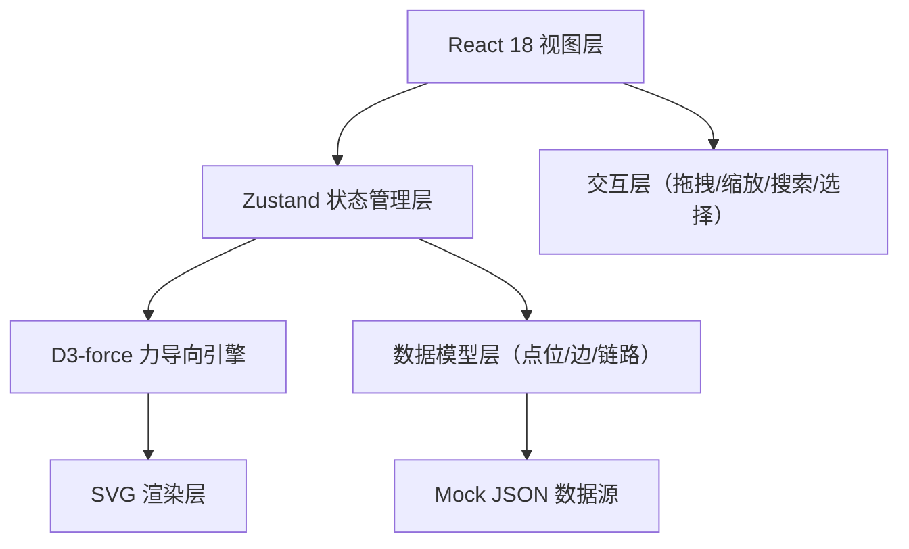
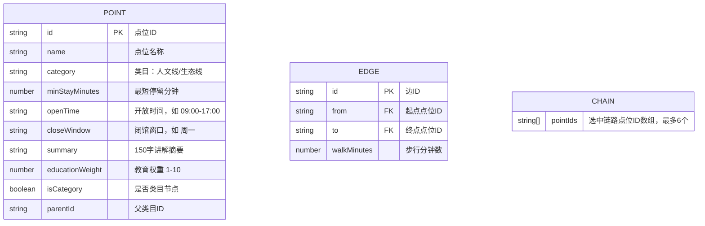

## 1. 架构设计



## 2. 技术说明
- **前端**：React 18 + TypeScript + Vite
- **样式**：TailwindCSS 3 + 自定义 CSS 动画
- **状态管理**：Zustand
- **图形引擎**：d3-force（力导向布局），原生 SVG 渲染（避免 canvas 交互复杂度）
- **图标**：lucide-react
- **后端**：无，纯前端，数据内置 mock JSON
- **性能优化**：
  - React.memo 包裹节点/边组件，避免全量重渲染
  - 力导向仿真 tick 节流（requestAnimationFrame）
  - resize 防抖 300ms
  - 18 节点首屏渲染目标 < 450ms

## 3. 路由定义
| 路由 | 用途 |
|------|------|
| / | 路线规划主页面（单页应用，仅此一个路由） |

## 4. 数据模型

### 4.1 数据模型定义



### 4.2 Mock 数据结构
```typescript
interface Point {
  id: string;
  name: string;
  category: 'humanity' | 'ecology';
  minStayMinutes: number;
  openTime: string;
  closeWindow: string;
  summary: string;
  educationWeight: number;
  isCategory?: boolean;
  parentId?: string | null;
}

interface Edge {
  id: string;
  from: string;
  to: string;
  walkMinutes: number;
}

interface RouteData {
  points: Point[];
  edges: Edge[];
}
```

## 5. 核心模块划分

```
src/
├── components/
│   ├── GraphCanvas.tsx       # SVG 画布容器 + 缩放平移
│   ├── GraphNode.tsx         # 单个节点（含拖拽）
│   ├── GraphEdge.tsx         # 有向边（贝塞尔曲线+箭头）
│   ├── CategoryBar.tsx       # 折叠类目汇总条
│   ├── DetailCard.tsx        # 节点详情右侧卡片
│   ├── SearchBar.tsx         # 顶部搜索栏
│   └── ChainInfoBar.tsx      # 底部链路信息栏
├── hooks/
│   ├── useForceGraph.ts      # d3-force 力导向布局 hook
│   ├── useDragNode.ts        # 节点拖拽 hook
│   └── useDebounce.ts        # resize 防抖 hook
├── store/
│   └── useRouteStore.ts      # Zustand 状态（点位/边/选中链/折叠状态）
├── data/
│   └── mockRouteData.ts      # 18 个点位 + 边的 mock JSON
├── utils/
│   ├── graphLayout.ts        # 布局辅助函数
│   └── timeCalculator.ts     # 时长粗算 + 闭馆冲突检测
├── pages/
│   └── RoutePlanner.tsx      # 主页面
└── App.tsx
```

## 6. 性能指标
- 首屏 18 节点渲染：< 450ms（通过 SVG 原生渲染 + 力导向预热布局实现）
- 拖拽帧率：≥ 50fps（React.memo + 仅更新位置属性）
- resize 防抖：300ms
- 搜索定位：scrollIntoView + pulse 动画 1.2 秒
